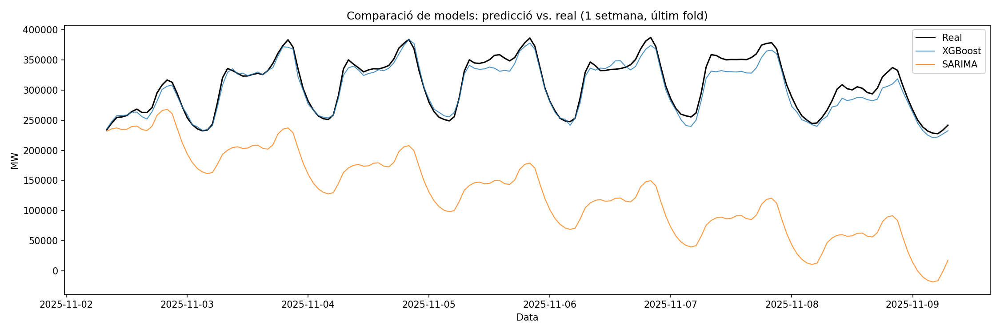

# Predicción de la demanda eléctrica en España

Proyecto de series temporales que predice la demanda eléctrica horaria en la península ibérica utilizando datos reales de la API de ESIOS (Red Eléctrica de España).

## Objetivo
Predecir la demanda eléctrica horaria a partir de patrones temporales (hora, día de la semana, mes) y valores pasados (lags), mediante un pipeline completo: extracción vía API → EDA → feature engineering → modelado → validación, comparando un modelo de machine learning (XGBoost) con uno estadístico clásico (SARIMA).

## Datos
- **Fuente**: [API ESIOS](https://api.esios.ree.es) (Red Eléctrica de España), indicador 1293 ("Demanda real")
- **Periodo**: año 2025 completo, resolución horaria (8.760 filas)
- **Extracción**: `src/get_demand_data.py`

## Análisis exploratorio
- Patrones claros de estacionalidad anual (más demanda en invierno y verano), semanal (menos demanda los fines de semana) y diaria (picos por la mañana y por la tarde-noche)
- **Evento atípico identificado**: el 28 de abril de 2025 se produjo un apagón eléctrico masivo en la península. En lugar de eliminar estos datos, se marcó con una variable binaria (`is_blackout`) para preservar la continuidad de la serie, y se excluyó del cálculo de métricas de evaluación

## Feature engineering
- Variables temporales cíclicas (sin/cos) para hora y mes, para capturar correctamente la continuidad (ej: hora 23 y hora 0 son consecutivas)
- Lags de 24h y 168h (una semana), los predictores más fuertes en este tipo de serie
- Variable binaria para marcar el día del apagón

Código reutilizable centralizado en `src/data_prep.py`.

## Modelado y validación

Se compararon dos enfoques:

- **XGBoost Regressor**: usa features temporales explícitas (hora, día de la semana, mes, variables cíclicas) y lags (24h, 168h)
- **SARIMA** (estacionalidad 24h): modelo estadístico clásico que solo usa la serie de valores pasados

**Validación**: `TimeSeriesSplit` (5 folds), respetando el orden temporal para evitar data leakage (crucial en series temporales, ya que un split aleatorio filtraría información del futuro a través de los lags). Para SARIMA, el horizonte de predicción se limitó a 1 semana por fold (en lugar de todo el bloque de test), ya que horizontes más largos degradan drásticamente su precisión por la acumulación de error en la diferenciación (d=1, D=1) — una limitación conocida de este tipo de modelo frente a XGBoost, que predice cada punto de forma independiente usando los lags reales.

### Resultados

**XGBoost** (5 folds, bloque completo por fold):
| Fold | MAPE | RMSE (MW) |
|------|------|-----------|
| 1    | 9.44%| 37,495    |
| 2    | 5.95%| 25,275    |
| 3    | 3.92%| 17,175    |
| 4    | 3.03%| 12,279    |
| 5    | 4.29%| 20,789    |
| **Media** | **5.33%** | **22,603** |

**SARIMA** (5 folds, horizonte de 1 semana):
| Fold | MAPE | RMSE (MW) |
|------|------|-----------|
| 1    | 51.02%| 197,161  |
| 2    | 19.43%| 64,176   |
| 3    | 26.01%| 101,620  |
| 4    | 17.72%| 64,185   |
| 5    | 58.34%| 192,612  |
| **Media** | **34.50%** | **123,951** |

**Conclusión**: XGBoost supera claramente a SARIMA en este problema (MAPE medio de 5.33% frente a 34.50%), principalmente porque puede aprovechar los lags reales (24h, 168h) en cada predicción, mientras que SARIMA genera el horizonte completo sin realimentación de datos reales, acumulando error progresivamente incluso en una ventana de solo una semana (visible en el gráfico, donde la predicción de SARIMA se aleja cada vez más de los valores reales). SARIMA sigue siendo útil como referencia estadística clásica, pero XGBoost es claramente más adecuado para este problema.

## Limitaciones y próximas mejoras
- XGBoost tiende a infrapredecir los picos de demanda, especialmente en invierno — probablemente por no incluir datos de temperatura, un factor clave en picos de consumo por calefacción
- Incorporar datos meteorológicos (AEMET) como variable explicativa
- Explorar modelos híbridos o redes neuronales recurrentes (LSTM) como siguiente paso

## Estructura del proyecto
├── data/ # datos brutos descargados
├── notebooks/ # 01_eda, 02_feature_engineering, 03_modeling
├── src/ # scripts reutilizables (extracción, preparación de datos)
├── outputs/ # gráficos generados
└── requirements.txt

## Cómo reproducirlo
1. Clona el repositorio e instala las dependencias: `pip install -r requirements.txt`
2. Solicita un token en la [API de ESIOS](https://www.esios.ree.es) y guárdalo en un archivo `.env` como `ESIOS_TOKEN=tu_token`
3. Ejecuta `src/get_demand_data.py` para descargar los datos
4. Sigue los notebooks en orden (01 → 02 → 03)