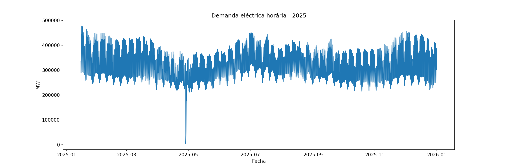
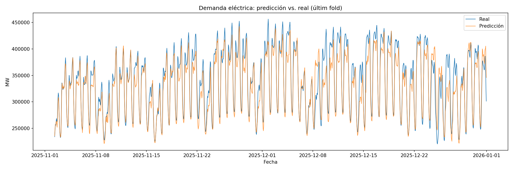
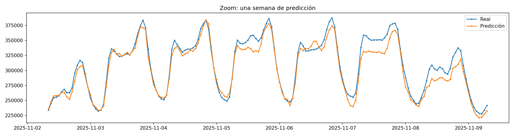

# Predicción de la demanda eléctrica en España

Proyecto de series temporales que predice la demanda eléctrica horaria en la península ibérica utilizando datos reales de la API de ESIOS (Red Eléctrica de España).

## Objetivo
Predecir la demanda eléctrica horaria a partir de patrones temporales (hora, día de la semana, mes) y valores pasados (lags), mediante un pipeline completo: extracción vía API → EDA → feature engineering → modelado → validación.

## Datos
- **Fuente**: [API ESIOS](https://api.esios.ree.es) (Red Eléctrica de España), indicador 1293 ("Demanda real")
- **Periodo**: año 2025 completo, resolución horaria (8.760 filas)
- **Extracción**: `src/get_demand_data.py`

## Análisis exploratorio
- Patrones claros de estacionalidad anual (más demanda en invierno y verano), semanal (menos demanda los fines de semana) y diaria (picos por la mañana y por la tarde-noche)
- **Evento atípico identificado**: el 28 de abril de 2025 se produjo un apagón eléctrico masivo en la península. En lugar de eliminar estos datos, se marcó con una variable binaria (`is_blackout`) para preservar la continuidad de la serie, y se excluyó del cálculo de métricas de evaluación

<!--  -->

## Feature engineering
- Variables temporales cíclicas (sin/cos) para hora y mes, para capturar correctamente la continuidad (ej: hora 23 y hora 0 son consecutivas)
- Lags de 24h y 168h (una semana), los predictores más fuertes en este tipo de serie
- Variable binaria para marcar el día del apagón

Código reutilizable centralizado en `src/data_prep.py`.

## Modelado y validación
- **Modelo**: XGBoost Regressor
- **Validación**: `TimeSeriesSplit` (5 folds), respetando el orden temporal para evitar data leakage (crucial en series temporales, ya que un split aleatorio filtraría información del futuro a través de los lags)
- **Métricas**: MAPE y RMSE, excluyendo el día del apagón del cálculo

### Resultados
| Fold | MAPE | RMSE (MW) |
|------|------|-----------|
| 1    | 9.44%| 37,495    |
| 2    | 5.95%| 25,275    |
| 3    | 3.92%| 17,175    |
| 4    | 3.03%| 12,279    |
| 5    | 4.29%| 20,789    |
| **Media** | **5.33%** | **22,603** |

El fold 1 tiene un error más alto por disponer de menos historia de entrenamiento. A medida que el modelo tiene más datos pasados, el error disminuye.

## Limitaciones y próximas mejoras
- El modelo tiende a infrapredecir los picos de demanda, especialmente en invierno — probablemente por no incluir datos de temperatura, un factor clave en picos de consumo por calefacción
- Se podría comparar con un modelo estadístico clásico (SARIMA) como alternativa
- Incorporar datos meteorológicos (AEMET) como variable explicativa

## Estructura del proyecto
├── data/ # datos brutos descargados
├── notebooks/ # 01_eda, 02_feature_engineering, 03_modeling
├── src/ # scripts reutilizables (extracción, preparación de datos)
├── outputs/ # gráficos generados
└── requirements.txt

## Cómo reproducirlo
1. Clona el repositorio e instala las dependencias: `pip install -r requirements.txt`
2. Solicita un token en la [API de ESIOS](https://www.esios.ree.es) y guárdalo en un archivo `.env` como `ESIOS_TOKEN=tu_token`
3. Ejecuta `src/get_demand_data.py` para descargar los datos
4. Sigue los notebooks en orden (01 → 02 → 03)